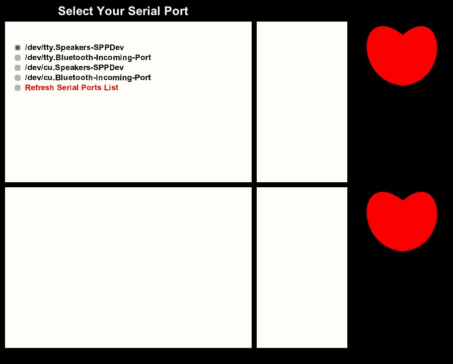
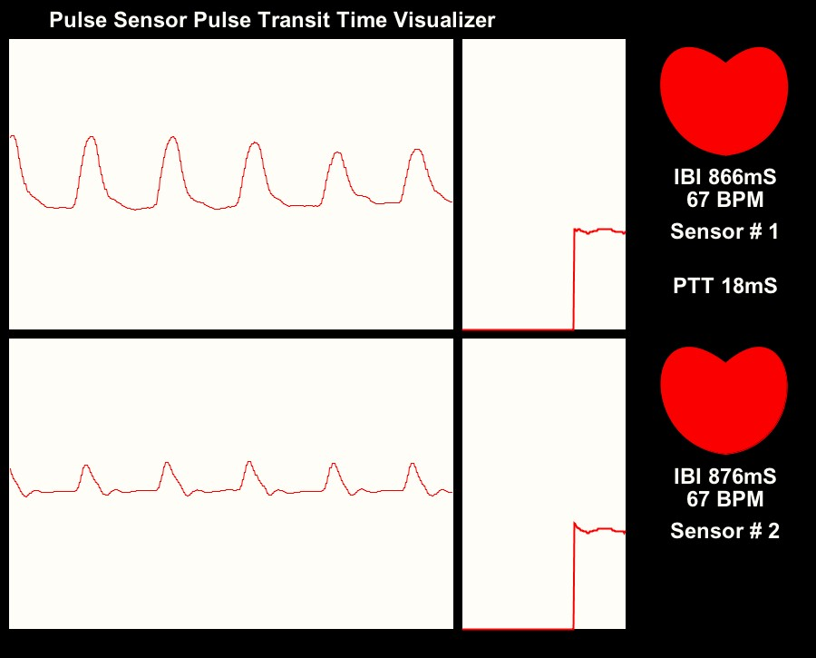

# Pulse Sensor Pulse Transit Time
Measures the time between beats on two Pulse Sensors. You can find our tutorial [HERE](https://pulsesensor.com/pages/pulse-transit-time).

If you don't already have Processing installed, get the latest version at [processing.org](https://www.processing.org). Then download the `ZIP` of this repository and extract it into your Processing Sketch folder. The sketch folder is usually located in

	User/Documents/Processing

When you run the program, you will be prompted to select the serial port that your Arduino is connected to. It's usually the one at the very top.

The Arduino sketch and this Processing sketch both expect that the Pulse Sensor plugged into Analog input 0 (Sensor #1) is connected closer to your heart than the Pulse Sensor plugged into analog input pin 1 (Sensor #2). In the screen shot below, Sensor #1 is connected to my earlobe, and Sensor #2 is connected to my fingertip.

This sketch allows you to take a picture of the program window, if you like what you see, by pressing the `s` or `S` key. The image is in JPG format and saved in a file called `Saved_Frames` in the sketch folder. 
You can also reset the data traces, by pressing the `r` or `R` key.